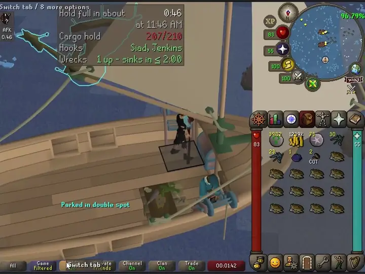
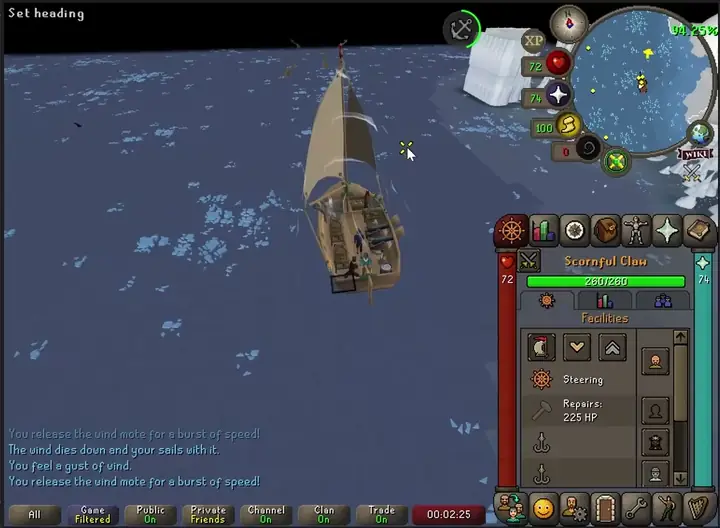
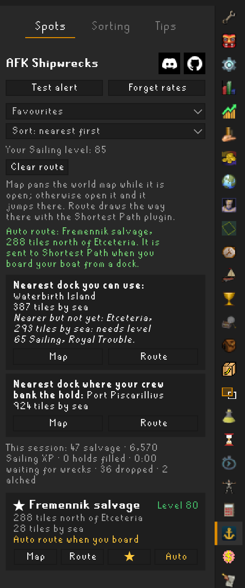
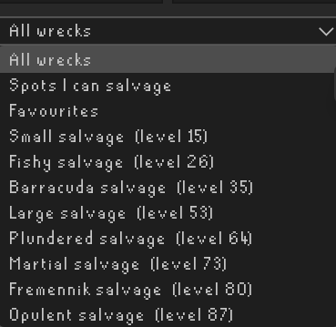
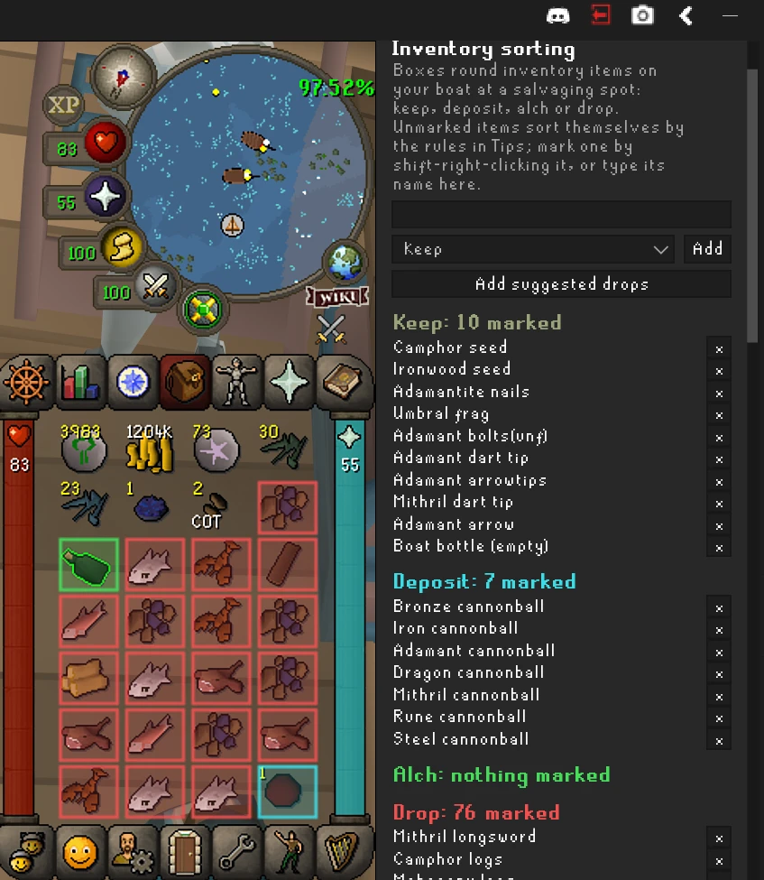

# AFK Shipwrecks

A RuneLite plugin for Sailing. Park at a shipwreck, put your crew on the hooks, and it tells you
how long until the cargo hold is full, then tells you loudly when it is.

It grew out of Cargo Hold Alert, and everything that plugin did is still here: the full-hold
alert, the banner, the early warning and the cargo counter. What is new is the timer and the
things an AFK salvager actually needs to hear about: a hook standing empty, the crew having
stopped, and the fact that your own hook does not restart itself.

## Screenshots



Parked in a double spot as the hold fills: the overlay counting down, the nearly-full and full
banners, the countdown infobox in the corner, then emptying the hold and the timer starting over.



Sailing in and parking: the reach boxes and the double spot appear as you arrive, the label counts
your hooks in, and once both are in it says you are parked.

<p>


</p>

The sidebar: every salvaging spot with its distance by sea, the nearest docks, and routes through
the Shortest Path plugin.



Inventory sorting: items get a box for deposit, alch or drop, and the Sorting tab lists what you
have marked. Keep has a box too, off by default; switch on "Box kept items" in the Inventory sorting
settings to see it. Without any marks, anything that high-alchs for 1,000 gp or more gets the alch
box by itself; change that amount with "Alch from" in the same settings. Marking an item Alch
yourself boxes it whatever its alch value, so the threshold only decides for items you have not
marked.

## What it does

- **Countdown to a full hold.** "Hold full in about 52 min", with the clock time if you like. It is
  built from the game's published salvage chances for your wreck, hooks and level, then corrected
  by what your crew actually bring in, so it shows a number from the first tick and gets better
  as it goes. Under ten minutes it counts in seconds.
- **Knows about wrecks sinking.** A wreck lasts about a fixed time once anyone starts salvaging
  it (the wiki's figures, from one minute for a small wreck to four for a merchant). The plugin
  tracks the wrecks in reach of your hooks, shows the longest one has left at most, and when none
  is up the timer pauses and says so rather than lying.
- **Knows about salvaging worlds.** On the official salvaging worlds (596 and 597, and any you
  add) every wreck site is being worked, so a sunk wreck near you is replaced quickly. Elsewhere
  your crew can sit idle for a long time. The plugin measures how much of the time a wreck has
  been up and folds that into the estimate. If you have been waiting a while on an ordinary
  world it mentions the salvaging worlds once in chat, and a flashing notice sits in the middle of
  the screen until a wreck is up or you hop (a setting, on by default). While you wait it also
  says when the next wreck can rise at your spot: the wrecks of an area share one pool and one
  rises the moment another sinks, and a wreck's timer starts when someone begins on it. The plugin
  starts a wreck's clock when it first sees a boat beside it (or when your own hook rolls on it),
  so the earliest sink among the others is the latest you will wait. "Next wreck here in ≤ 3:20"
  means exactly that; "likely" is added when another empty site in the area could take the rise
  instead. Lifetimes are the wiki's averages, so a wreck can outlive its clock: the line then says
  "any moment", and a minute past the clock the plugin drops it until the wreck is seen worked
  again. Where nobody is working the other wrecks there is nothing to go by and no line.
- **Counts you too.** Salvage you hook yourself goes to your inventory first; the plugin counts
  it as bound for the hold and knows you stop when your inventory is full or the wreck sinks.
  Salvage you withdraw to sort is never counted, and sorting shows its own little countdown.
- **Hook reminders.** Step off your hook to sort and forget to hand it over, and after a short
  grace period it reminds you: "A salvaging hook is empty. Assign a crewmate to it." (Only at a
  salvaging spot, with a wreck site, up or sunk, within reach of your hooks; an empty hook on the
  way there, or at a dock beside the spots, is your business.) If nobody
  aboard can take the hook (a crewmate needs enough deckhandiness for it) and a wreck is up, it
  asks you to click the hook instead, because unlike your crew you do not restart by yourself.
  And if a crewmate with more deckhandiness is sitting idle while a weaker one works a hook, it
  says who to swap, once the pair has stood ten seconds, and a flashing "SWAP CREW" notice sits in
  the middle of the screen (and a Swap line on the overlay) until you do. That one only speaks
  when every hook is manned; an empty hook comes first.
- **Crew stopped.** Crew salvage on your level, boosted or not. If it drops below what the wreck
  needs they stop; the plugin says so.
- **Full-hold alert.** Sound, tray popup, screen flash, focus, whatever you set up in RuneLite,
  plus a big red banner, an early warning at 5 slots left (your number; 0 turns it off) and a
  repeat.
- **Idle logout.** If the hold will take longer to fill than you have left before the game logs
  you out for idling, it shows that too, and a minute before the logout (your choice how long) it
  sends a notification while you are on your own boat, once per idle stretch. It cannot press a
  key for you.
- **A countdown infobox.** Optionally, the time to a full hold as one of RuneLite's small
  infoboxes, AFK written above the time and the detail on hover, so it stays in view with the
  overlay hidden.
- **A sidebar with three tabs.** Spots (Test alert and Forget rates at the top, the nearest dock and the list), Sorting
  (each inventory sorting list with what you added, and the default cannonballs under Deposit) and Tips.
- **Knows where the wrecks are.** The Spots tab lists all 29 salvaging hotspots, filtered by
  wreck, down to the ones your level allows, or to your favourites, sorted by wreck or nearest to
  you first, with the Sailing level each needs, where it sits from the nearest port and how far it
  is from you. Every one has a Map button, which centres the world map on it, a Route button,
  which hands it to the Shortest Path plugin to draw the way there (without that plugin it tells
  you to install it), a star to pin it to the top, and Auto, which marks it as the one spot to
  route to by itself whenever you board your boat from a dock. The dropdowns are remembered.
- **Knows where the docks are, and which you can use.** The top of the sidebar names two: the
  nearest dock you can use, and the nearest dock where your crew bank the hold, meaning one with a
  bank deposit box where your first crewmate banks the hold's contents as you step off (21 of the
  61 docks, from the wiki) or the bank boat in the Barracuda Belt, which you bank at from your own
  deck. Each sits in its own box with its distance and its own Map and Route buttons; the banking
  box is left out when the dock you can use is itself one where the crew bank. Each of the
  61 docks carries the Sailing level (not boostable) and the quest it needs, from the wiki; a nearer
  dock you do not yet qualify for is named with what it needs. Things the client cannot see, such as
  a first visit to Kourend or Varlamore, the items worn for Entrana, or the raft needed for
  Wyrmscraig Cavern, are shown rather than checked.
- **A session line and two tools.** How much has been salvaged, the Sailing XP, holds filled and
  time spent waiting for wrecks at a spot since the client started; a Test alert button that fires the
  full-hold notification and banner so you can check your set-up; and Forget rates, which
  throws away what the timer has learned about your crew's speed. The Tips tab explains the boxes,
  the buttons and the rest of this README in short.
- **Boxes on the water that say where to park.** A yellow box around each wreck for where a hook
  can reach it, and a green box where a hook reaches two wrecks at once. Park so every hook on your
  boat sits in the green box and it changes colour and says "Parked". Each has its own switch and
  colour, and the parked colour is its own setting too. The green boxes go 20 seconds after the boat stops, at
  login too, and come back the moment it moves (a setting; 0 keeps them). While you stay parked,
  the words "Parked in double spot" stay in the middle of your boat (a setting, on by default). The
  box's own words about your hooks sit there too. Wrecks that are up and within
  your level get a soft cyan outline round the hull, like the game's own hover outline, so the one to
  work stands out without another box (a setting, on by default).
  Read the section below before trusting them to the tile.

- **Sorts your inventory for you to act on.** On your boat at a salvaging spot, inventory items
  get a coloured box: sage keep (an outline only, and off unless you switch it on, since what stays
  needs nothing doing), cyan deposit
  (into the cargo hold), green alch, red drop. With
  nothing marked, only two kinds get a box: the plain bronze to dragon cannonballs are Deposit (never noted ones, which
  the hold refuses; each is listed in the Sorting tab with an × that takes it out of the defaults,
  and marking it Deposit again brings it back), and items whose alch value is at or above a
  threshold you set (1,000 by default) are Alch. Everything else gets no box, and nothing is ever Drop until you mark it.
  To start a Drop list quickly, the Sorting tab's "Add suggested drops" button adds 74 items most
  players drop (logs, planks, nails, bars, low runes, raw fish, fishing gear, seeds, uncut gems,
  seaweed, rings and the like; none alchs for 1,000 gp or more) as your own marks, after asking; anything you already put in a list is left alone, and each
  one gets an × like any other mark.
  Repair kits, fish and the other things the hold takes are never called an alch either; the
  plugin knows them from the wiki's list and learns the game's own answer every time you open the
  hold. Shift-right-click an item and its AFK Shipwrecks entry opens to Keep, Deposit, Alch, Drop and Unmark; pick one
  to mark it, or add it by name in the Sorting tab, and take it off again there. The boxes are only ever boxes: nothing is
  dropped, alched or moved for you, and the menu entries they add send nothing to the game. While
  the cargo hold is open only the Deposit boxes show, in the inventory panel beside it, so what to
  deposit stands out right where you deposit it and nothing else gets in the way.
- **Says when it was updated.** The first time you log in after the Plugin Hub has updated the
  plugin, one line in chat says what the new version brings. A setting turns it off.

Everything comes from game state your client already has. No web requests other than RuneLite's
own world list, no accounts, nothing sent anywhere, and it never clicks anything for you. It does
not need any other plugin; Shortest Path is optional and only used when you press Route or have
marked a spot Auto.

## The overlay

A small panel at the top of the game while you are on your own boat and a wreck site is in view
(or whenever you are aboard, if you set "Show overlay" to always; alerts show either way):

```
Hold full in about   52 min
                  at 2:32 PM
Cargo hold          188/240
Hooks    Jenkins, Jolly Jim
Wrecks   2 up - last sinks in ≤ 1:20
```

The time is always a forecast, hence "about". Early on it rests mostly on the published tables and
firms up after about 25 salvages have been seen; until then the "Left to salvage" line, shown
while waiting for a wreck, carries a "~". Other lines you may see:

- `open the cargo hold once to start`: it needs one real count to work from.
- `Waiting for a wreck  1:20 so far` and `Left to salvage  34 min`: nobody can salvage until a
  wreck rises; the second line is what remains once one does. The clock counts time at the spot,
  not the voyage there; on the way, with nothing in reach, the line reads `no wreck site in reach`.
- `Hooks  Jenkins - 1 empty (no crewmate can use it)`: a hook is standing empty.
- `Crew stopped  Sailing level too low (needs 87)`.
- `Hold  full by the tally; open it to check`: the running tally says full, but nothing has
  confirmed it. If the crew keep bringing salvage in, the tally was high: it becomes
  `Hold  tally has drifted; open it to resync` and stays there, without alerting again, until you
  open the hold or a crewmate says it is full.
- `Timer  crew do not seem to be salvaging`: far more salvage was expected than has arrived. Check
  the hooks are really in range of the wreck. The last countdown stays up while it works this out.

## Settings

**Timer**: show timer (turning it off hides the countdown lines; the status lines, such as waiting
for a wreck, stay); show clock time; clock format (12-hour or 24-hour); count salvage you hooked; salvaging worlds (default
`596, 597`); salvaging world tip; salvaging world alert (a flashing notice mid-screen while you wait for a
wreck off those worlds, on by default).

**Reminders**: seven RuneLite notifications you can shape separately (hook empty with a crewmate
free; your hook is idle; a better crewmate is free; crew stopped because your level is too low;
idle logout coming; and two that are off unless you want them: waiting for a wreck, once every
wreck in reach has been down ten seconds, and done sorting at the station, five seconds after the
game says so and only if you have not clicked anything since), whether the swap also flashes mid-screen (on by default), the
grace period before the first reminder (10 s by default; using the hold buys a little more,
settling in to sort shortens it), how often to repeat, and how long before the idle logout to
warn (60 s; 0 never).

**Default notification**, at the top of the settings: how every notification in the plugin is sent
unless its own setting is off or set to custom with the cog. Left plain it is RuneLite's own
notification settings; make it custom once and every category follows. **Cargo full** and **Early
warning**: as before. **Banner**: as before, now 150% in size by default, plus a
colour for the reminder banner and a colour for the nearly-full banner. **Overlay**: when to show it (near
wrecks, or always aboard), the cargo counter and what it shows (used of total, slots left or
percent full), the hooks line, the wrecks line, text size (150% by default), and the countdown infobox (off by
default). Whatever the settings, the overlay and the flashing notices step aside while a game
interface fills the middle of the screen (the cargo hold, a skill guide, the quest journal, a
diary, the collection log, the settings, the world map) and come back when it closes.

**Colours**: only the ones you notice are settings: the banners, the boxes on the water and the
four sorting boxes, each in its own section. The overlay text, the counter's shading, the sidebar
and the chat lines use fixed colours, to keep the settings short.

**Inventory sorting**: box inventory items; where (on my boat at a salvaging spot, whenever aboard,
everywhere); the alch threshold; keep instead when the GE price beats the alch value by a margin
(off by default); the shift-right-click AFK Shipwrecks menu, shown only on your own boat; whether kept items get a box at all (off by default);
highlighting the cargo hold itself in the Deposit colour (off by default); boxing the salvage
inside the open hold so it is easy to find and click (on by default); and the four colours. Under Salvage spots, "Only docks I can use" turns the dock requirements check off.

**Salvage spots**: show the sidebar; wreck reach boxes (hidden while you are parked, on by default) and their
colour (yellow); outline wrecks that are up (on by default); double spot boxes (on or off), their
colour (green) and the colour they change to once you are parked (a faint cyan); whether to label the
double spot boxes; how long after the boat stops they go (20 s; 0 never); whether "Parked in double
spot" stays once they have gone (on by default); show the nearest docks (the
one you can use and the one where your crew bank the hold); and auto route when boarding (the spot itself is marked in the sidebar). Favourites, the dropdown choices
and the Auto spot are kept per character, filed against the id Jagex gives the account rather than
its name, so a name change keeps them and two characters on one RuneLite account do not share an
Auto spot. Which items you mark Keep, Deposit, Alch or Drop is shared across your characters:
each character's marks are kept under their own id and the lists you see are all of them
together, so two clients open at once never overwrite each other's marks (RuneLite only
downloads settings when a client starts, so the other client shows a new mark after a restart).
One catch with two clients open: if you unmark an item on one, then mark something into the same
list on the other before restarting it, the other client still has the old list and the item
comes back. Restart the other client after unmarking to avoid it.

## Salvage spots and double spots

The sidebar uses the same list of hotspots RuneLite's own World Map plugin draws its salvaging
icons from, so it agrees with the icons already on your map. Hovering one of those icons already
names the salvage and its level, and spots above your level are marked, both on by default in the
World Map plugin's settings, so this plugin adds no markers of its own. Each spot is
described from its nearest port in a straight line, for example "Barracuda salvage, 25 tiles
south-west of Ruins of Unkah", because six Barracuda spots called "Barracuda salvage" would not
help anyone. The world map can only be moved while it is open and nothing lets a plugin open it
for you, so if you press Map with the map closed the plugin remembers the spot and jumps to it the
moment you open the map yourself. Route posts the spot to the Shortest Path plugin over RuneLite's
plugin message bus. If Shortest Path is not installed, or is installed but switched off, the sidebar
says so in red and the same line appears in your chat, with what to do about it. With a spot
marked Auto, stepping from a dock onto your own boat sends that spot to Shortest Path by itself and
says so in chat; logging in aboard, hopping worlds and leaving the boat at sea do not count as
boarding. The "tiles by sea" under each spot is a sailing distance: the plugin carries a small map
of the water (the surface cut into four-tile cells, each marked sea or not, built from the game's
own map data by the tool in `tools/seamap`) and finds the shortest way over it from where you are,
so a spot on the far side of a peninsula reads as the voyage round it rather than the crow's flight
across. It is a few tiles out at most, and it shows once you are on the water or at a dock; inland
there is no sea to measure from, so the rows show no distance. Sort: nearest first uses the same
distances. The two docks are the nearest of the same moorings the World Map plugin draws (plus the
bank boat): by sea when you are afloat, and as the crow flies when you are ashore, since then you
walk to them. A route
to a spot, whether you pressed
Route or it was the Auto spot, is cleared again once you pull up to one of the spot's wrecks or
step off your boat, so the line does not hang about after it has done its job.

The boxes are worked out, not looked up. A hook works any wreck within its reach, and reach is
measured as a square around the wreck: that square is the yellow box. Where two yellow boxes
overlap, a hook parked in the overlap works both wrecks: that overlap is the green box, labelled
"Double spot" (with how many of your hooks are in it, or "Parked"). The game measures reach from the hook rather than the boat (a game update
changed it to that), so the boxes are about where a hook has to sit, not the whole boat. Your own
hooks are known, so when every hook on the boat is inside a green box, both on a sloop, the box
changes to the parked colour and says "Parked"; with only one of two in, the label says so and the
colour stays. Nudge the boat until it changes. Once parked, the yellow boxes go, to clear the view (a
setting, on by default). The honest caveat: the reach is taken as 8 tiles from other plugins'
observations and has not been confirmed from the game's own code, so a box edge may be a tile off.
If your hook sits in a box and only one wreck is being worked, tell me and I will fix the number.
A double spot is a place, not a moment: the green box shows whenever its two wreck sites are in
view, whether both wrecks are up, only one, or neither, since the next wreck rises on the same tile.
So you can park in it and wait. Sunk wrecks' yellow boxes are drawn dimmer.

## What it can and cannot know

Here is the honest version, because a countdown invites more trust than a counter.

1. **The hold count.** The game only sends the hold's contents while the hold interface is open.
   Between openings the plugin keeps a tally: one for each crewmate line *"Managed to hook some
   salvage!"*, one for each Sailing XP drop that matches a crewmate's share (a crewmate earns you
   10% of the wreck's XP per point of deckhandiness, so the size of the drop says who earned it;
   this is how Cabin Boy Jenkins, who only says "Wooo", is counted), and your own deposits and
   withdrawals from your inventory changing. The tally is remembered per boat. Opening the hold
   resyncs it instantly.
2. **The rate.** It starts from the wiki's success tables for your wreck, hook and Sailing level
   and learns a correction from what actually arrives, remembered per wreck between sessions.
   Expect the first countdown to be within about 20%; it tightens over the next quarter hour.
3. **Wreck timers are ceilings.** A wreck's clock starts when *any* player first salvages it,
   which your client cannot see. "Sinks in ≤ 2:40" means no later than that, counted from the
   moment your own hooks started working it.
4. **Respawns.** When a wreck sinks the next one rises somewhere in the area, not necessarily
   next to you. The plugin cannot predict when your site refills; it measures how often a wreck
   has been up and shows how long you have waited. That is why the salvaging worlds are worth it.
5. **Your own hook stops.** When the wreck you are on sinks you stop and do not restart, unlike
   your crew. The plugin tells you; it cannot click for you.
6. **Crewmate stats** come from the game's crew table, with the wiki's figures as a fallback and
   a middling guess for anyone it cannot place. A keg of whirlpool surprise is taken into account.
7. **Only your own boat.** On someone else's boat you get one notification when their crew say
   the hold is full, and nothing else: no timer, no counter, no reminders. Barracuda Trials,
   trawling and courier cargo are not tracked.
8. **Fully AFK still means touching the client** before the game's idle logout. The overlay
   warns when the hold will outlast it.
9. **Things that need confirming in game.** The player animations for salvaging and sorting, the
   crew assignment values for the two sloop hooks, and the hook's reach (taken as 8 tiles, which the
   double salvage spot boxes also rest on) come from other plugins' observations and the wiki rather
   than from the game's code. If you find a case where the plugin is consistently wrong, tell me what
   you were doing and I'll chase it.

## Install

Search for **AFK Shipwrecks** in the RuneLite Plugin Hub.

For development: clone the repo and use `./gradlew run` for a development client or
`./gradlew test` for the tests. In IntelliJ, run `AfkSalvagingPluginTest`.

## Found a bug? Want something?

Open an issue on GitHub: <https://github.com/Brettgod1355/AFK-Shipwrecks/issues>. If you'd rather,
ask a question, make a suggestion or report a bug on Discord instead:
<https://discord.gg/c85DK83jWx>. Both are one click away from the buttons beside the sidebar's title.

## License

BSD 2-Clause. See [LICENSE](LICENSE) and
[THIRD_PARTY_NOTICES.md](THIRD_PARTY_NOTICES.md). Not affiliated with Jagex or
RuneLite.
